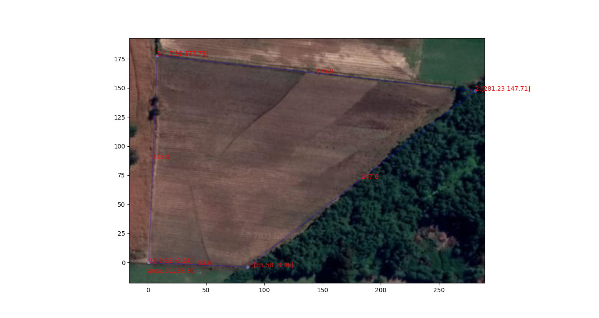
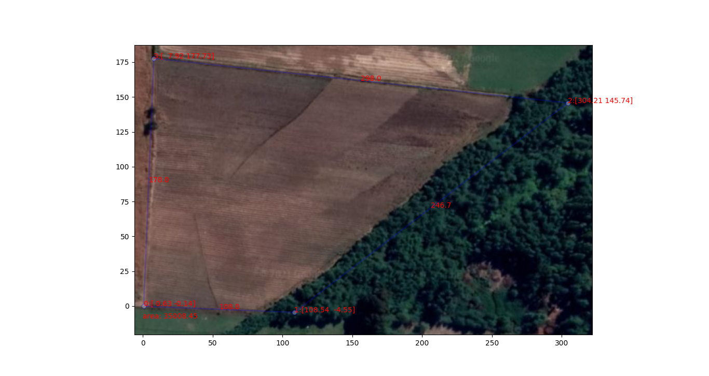
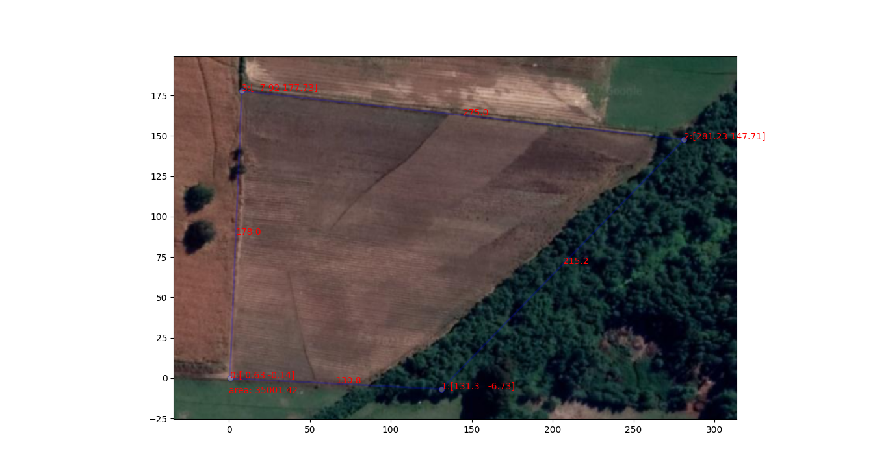
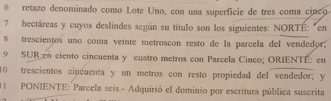
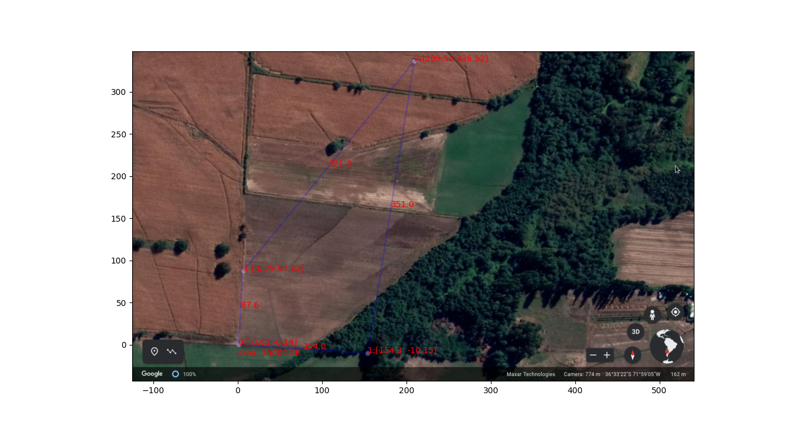
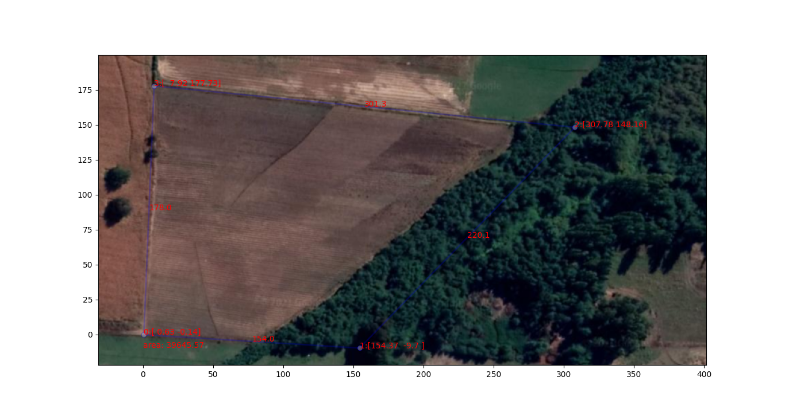

# Servicios topográficos

- El código está disponible y bajo licencia [ANTI-CAPITALIST SOFTWARE LICENSE (v 1.4)](./LICENCE)
- [check.py](./src/check.py) es un script que mide area con 4 puntos de latitud, longitud en un elipsoide
- [InteractiveTerrainAreaCalculator.ipynb](./src/InteractiveTerrainAreaCalculator.ipynb) es un jupyterlab notebook que implementa una herramienta interactiva para subir una figura tomada de google earth y ajustar un polígono, en coordenadas cartesianas

# Resumen Informe v2

- Bajar en pdf: [Informe1](InformeMediciondeTerreno.pdf), [Informe2](InformeMediciondeTerrenoV2.pdf)
- Se dirime conflicto con límite oriente de terreno
- Se muestran y revalidan los resultados del informe anterior de manera didáctica
- Todas las medidas en metros si no se indica unidad

# Resultados

## Medición Conjunta entre las partes
El día sábado 20 de marzo de 2021, 15:00. En conjunto entre las partes interesadas se recorrió el perímetro actual del sitio "bordeando el canal", con una huincha de medición:  

 - Se valida la herramienta puesto que entrega las mismas medidas base obtenidas ese día:
     - Deslinde Poniente 178m
     - Deslinde Sur 85m
     - Deslinde Norte 275m
 - Se obtiene un area actual de 31.233,36 m² ~ 3,1há, faltan 0,4há según la escritura de compraventa
 
  

## Solución recomendada 
Conforme al informe anterior, para completar las 3,5 há, se recomienda continuar las lineas de los cercos actuales hacia el oriente, avanzando 23m. Así los deslindes modificados son:  
- Deslinde __Sur__ 108m (85 + __23__)  
- Deslinde __Norte__ 298m (275 + __23__)  

Obteniéndose la superficie requerida de 3,5há (35008.45)

## Solución alternativa
Si bien hay son infinitas alternativas para generar un polígono de 3,5há. Por simplicidad de implementación, se consideran sólo las que no mueven los cercos actuales, ni cruzan el canal. Luego la alternativa de sentido común -para cuadrar lo más posible la figura, consiste en sólo avanzar el deslinde sur, resultando en una recomendación de modificar:  
- Deslinde __Sur__ 131m (85 + __46__)  

Obteniéndose la superficie requerida de 3,5há (35001.42)

# Conclusión
El deslinde del terreno en entredicho está a 23m más allá del canal para honrar el documento de compraventa original de 3.5há, y no así siguiendo la línea del canal.  
Alternativamente se puede generar una rectificación equivalente moviendo el deslinde sur en 46m.

Fernando Badilla  
Ingenierio Civil  
M.S. Operations Research  
Universidad de Chile  

# Anexos
## Detalles de planos
### Medida Conjunta

    - Area: 31233.36  
    - Lados: [85.03, 247.56, 274.96, 178.03]  
    - Vértices: [(0.6315442868393308, -0.14402351755704057),  
         (85.5786272609407, -3.9621101736671553),  
         (281.23482636463547, 147.70882955020787),  
         (7.920442067030843, 177.73478042519938)]  
         
### Solución Recomendada

    - Area: 35008.45  
    - Lados del polígono: [108.0, 246.73, 298.01, 178.03]  
    - Vertices: [(0.6315442868393308, -0.14402351755704057),  
         (108.53955034202447, -4.551105504599588),  
         (304.20804301176537, 145.7447525226361),  
         (7.920442067030843, 177.73478042519938)]  
         
### Solución Alternativa

    - Area: 35001.42  
    - Lados del polígono: [130.83, 215.25, 274.96, 178.03]  
    - Vertices: [(0.6315442868393308, -0.14402351755704057),  
         (131.2999098470501, -6.727918468139406),  
         (281.23482636463547, 147.70882955020787),  
         (7.920442067030843, 177.73478042519938)]  

## Planos insuficientes
### Deslindes de la escritura
Como se aprecia a continuación, la escritura indica 3,5 há:  

  

Para luego continuar con los siguientes deslindes:  

    - Norte: 321.2  
    - Sur: 154  
    - Oriente: 351  

  

    - Area: 35002.26  
    - Lados del polígono: [154.0, 351.04, 321.32, 87.59]  
    - Vertices: [(0.6316884466397772, -0.14404252868571377),  
         (154.30300909939984, -10.15054354761331),  
         (209.51873007449916, 336.51651865862505),  
         (6.785054605092211, 87.22766713826408)]  

### Corrección sugerida
La propuesta enviada de 154, 223.1, 301.2 y 178m son 4há y no 3,5há -como se ve a continuación:

    - Area: 39645.57  
    - Lados del polígono: [154.03, 220.13, 301.31, 178.03]  
    - Vertices: [(0.6315442868393308, -0.14402351755704057),  
         (154.36881259076864, -9.704133912639257),  
         (307.78040012018243, 148.16420426467457),  
         (7.920442067030843, 177.73478042519938)]  