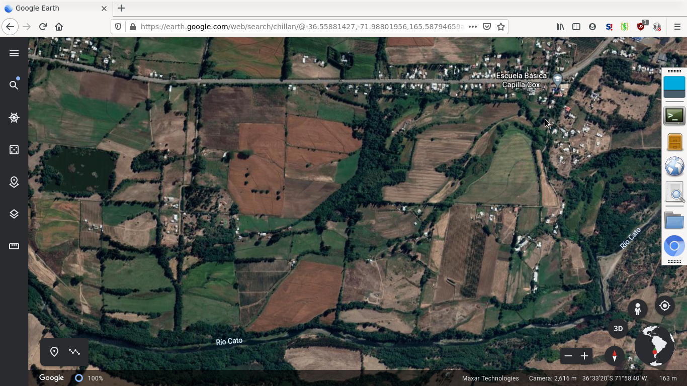
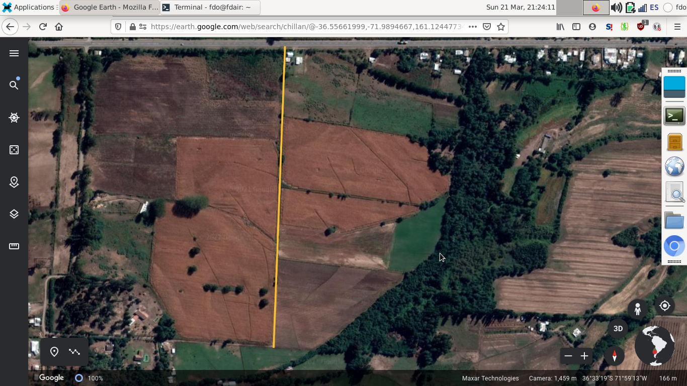
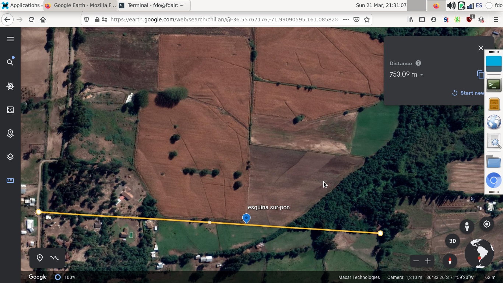
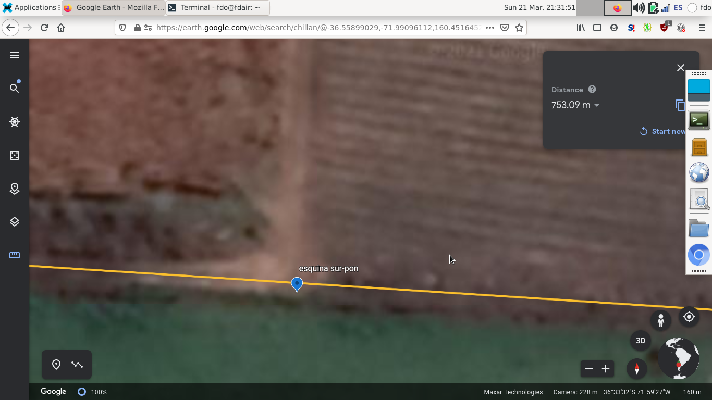
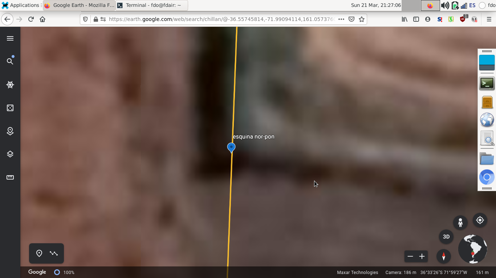
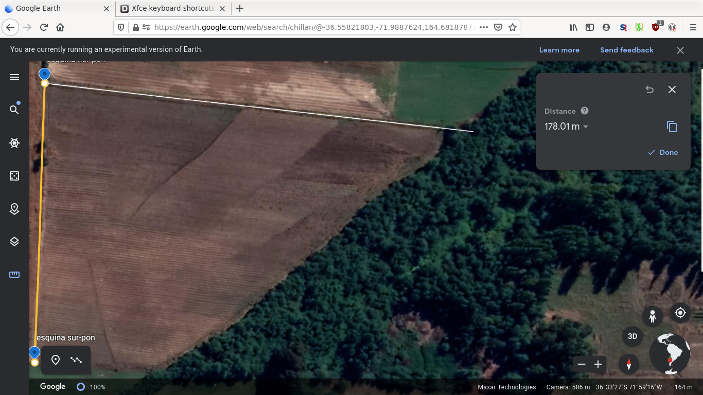
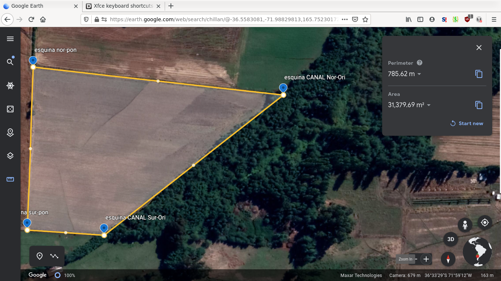
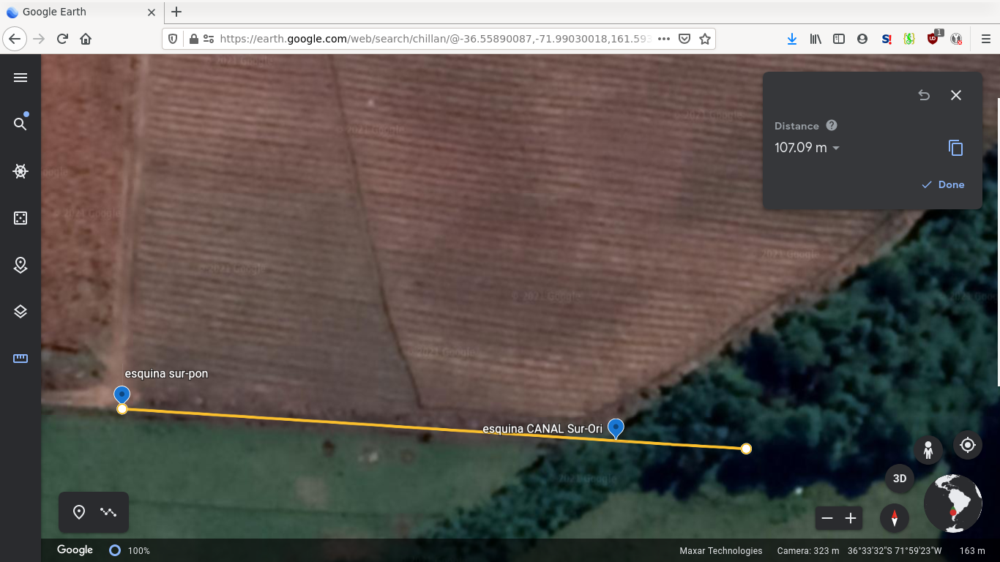
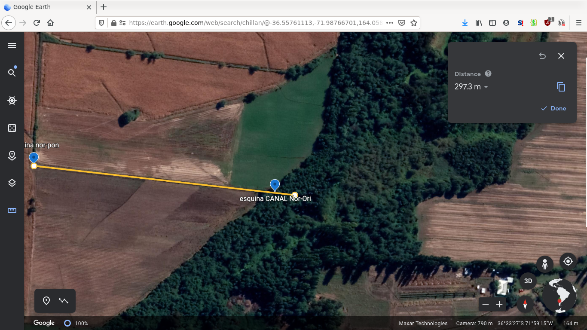
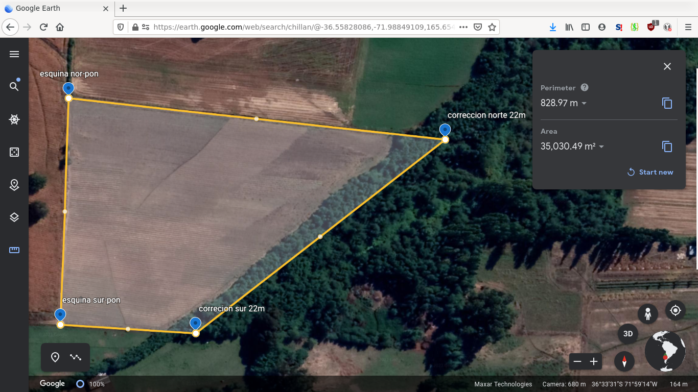

medicion de terreno

# Ubicación
- El terreno está en Chillán, sector reloca antes de Capilla Cox específicamente (al norte del Rio Cato, y al sur de la carretera) en la esquina Sur-Poniente de la parcela 7 del Proyecto de parcelación Santa Raquel, al centro de la figura:  

  

- Más en detalle se aprecia que la parcela 7 colinda con al norte con la carretera. Se dibuja la línea divisoria al poniente (izquierda) y la línea divisoria al sur (derecha, extendida al poniente para alinear), para especificar su ubicación y obtener referencias para encontrar las esquinas del terreno:  

    

# Antecedentes
- Se encuentra en entredicho el limite oriente del terreno en cuestión, el cual fue adquirido por don Manuel Alejandro Zenteno Arias (actualmente Sucesión Zenteno) a don Jaime Andrés Castillo Rosales, que intermedió entre don Milton Antonio Parra Viscay (padre de los dueños actuales de la parcela 7).
- El terreno limita hacia el norte y oriente con la parcela 7 (del Proyecto de parcelación Santa Raquel) justamente porque el terreno en cuestión fue vendido como retazo de 3.5 hectáreas de la esquina sur-poniente de ésta, como indica escritura.
- Este documento de compra venta (adjunta) inscrita en conservador, indica principalmente:
	- Área: 3,5 há
	- Deslinde Norte : 321,2m con resto de la propiedad del vendedor
	- Sur : 154m con parcela 5
	- Poniente : Parcela 6
	- Oriente : 351,m con resto de la propiedad del vendedor
- La documentación de la escritura y el mapa de la parcelación ambos documentos legales inscritos en el conservador, se pueden consultar acá (carpeta doc).

# Objetivo
Determinar un terreno de 3.5 há circunscrito en los límites impuestos por los cercos actuales, precisando si el limite oriente esta dado por el canal o no.

# Metodología
## Herramientas
- Las líneas, cálculos de área y fotos satelitáles se harán usando [Googlearth](https://earth.google.com/web/search/chillan/@-36.5577579,-71.98897207), y se adjuntarán todas las imágenes de los pasos de cálculo (carpeta img)
- Se verificarán los cálculos del programa anterior, con un script en python de programación propia (carpeta src)

## Pasos
1. Usar el plano del "Proyecto de parcelación Santa Raquel" inscrito en el conservador de bienes raices para determinar los límites poniente y sur (lineas vertical y horizontal mostradas en sección Ubicación) que determinan la esquina sur-poniente del terreno vendido (EsquinaSurPon en la lista de puntos satelitales).
2. Usar la cerca actual al norte para determinar la esquina nor-poniente (EsquinaNorPon en la lista de puntos satelitales)
3. Con las tres lineas delimitorias cerrar el polígono:
    3.1 Usando las distancias medidas en conjunto
    3.2 Corrigiendo para delimitar un paralelogramo que circunscriba 3,5 há.
4. Programar y ejecutar el script de verificación de cálculos usando los puntos marcados

# Desarrollo
1. Se encuentraron las lineas que delimitan las parcelas 5, 6 y 7, (adjuntas lineas en kml, se muestran en imágenes sección ubicación)
2. Se encontraron las esquinas Sur-Poniente y Nor-Poniente usando las lineas encontradas en el punto anterior (la esquina de las parcelas 5,6y7 y el cerco norte con la línea.
    

3. Se encontraron las esquinas Orientes __-sobre el canal-__ según las medidas tomadas el día sábado 20 de marzo de 2021 15:00 en conjunto entre las partes interesadas. Es decir:
 - Desde la esquina nor-poniente 275m hacia el oriente sobre la cerca (distancia satelital obtenida entre lo demarcado 274.3)
 - Desde la esquina sur-poniente 85m hacia el oriente sobre la cerca (distancia satelital obtenida entre lo demarcado 84.7)
 - Ejemplo de la construcción del polígono, __notar que la herramienta acumula la distancia__  
 
    

4. Se encuentra el area dada por la herramienta de google earth usando las delimitaciones del canal: 31,379m2; es decir efectivamente falta una franja más allá del canal para completar las 3,5 há (área 0.362há).  

  

5. Para encontrar la franja faltante de se utilizará un paralelógramo (rombo de lados paralelos o rectángulo inclinado), de manera de simplificar la implementación al considerar que ambas esquinas serán movidas en la misma medida:
	- altura: 178m (del deslinde poniente) 
	- Area = base * altura, i.e., 3620m2 = x * 177m, resultando x~22m 
	- Es decir, el deslinde del terreno al oriente debe considerar alrededor de 22 metros más allá del canal.
    
6. Se demarcan los nuevos puntos utilizando los anteriores para mantener la linea con los cercos:  

  

7. La nueva area encontrada es la siguiente 35,030m2:  

    

8.Los resultados del script de verificación son los siguientes:
> Nombre, longitud, latitud  
> EsquinaSurPon, -71.99102662055196, -36.5590569336488  
> EsquinaNorPon, -71.99095095463721, -36.55745899506146  
> CanalSurOri, -71.99007947963798, -36.55910461830111  
> CanalNorOri, -71.98789853025825, -36.55773200165535  
> CorreccionNor, -71.98765077758628, -36.55775453595719  
> CorreccionSur, -71.98983316238962, -36.55911493239699  
> distancia entre EsquinaSurPon y EsquinaNorPon : 177.80064045279852  
> distancia entre EsquinaSurPon y CanalSurOri : 84.75592565500348  
> distancia entre EsquinaSurPon y CorreccionSur : 106.78361829982391  
> distancia entre EsquinaNorPon y CanalNorOri : 274.3045350562466  
> distancia entre EsquinaNorPon y CorreccionNor : 296.57328063199293  
> Area terreno medido 29959.27537273435  
> Area corregida 35052.750946411565  

Donde se aprecia que la corrección de 22m efectivamente logra circunscribir las 3.5há

# Conclusión

__El deslinde del terreno en entredicho está a 22m más allá del canal para honrar el documento de compraventa original de 3.5há, y no así siguiendo la línea del canal.__  

En particular se debe corregir:  

    - El borde norte de la propiedad es de 297m (275+22)  
    - El sur es de 107m (85+22)  

Donde se utiliza como base las medidas principales (275 y 85) recogidas en conjunto entre las partes interesadas el día 20 de marzo, la escritura (3.5 há) y las líneas principales de la parcela 7.  

Se adjuntan los puntos satelitales demarcados en el estudio con los cuales se verificaron los cálculos entregados por la herramienta googleearth.  

Finalmente se estima que un estudio en profundidad y en terreno por un topógrafo profesional no cambiará en más de un metro esta estimación (22).

Fernando Badilla  
Ingenierio Civil  
M.S. Operations Research  
Universidad de Chile  
