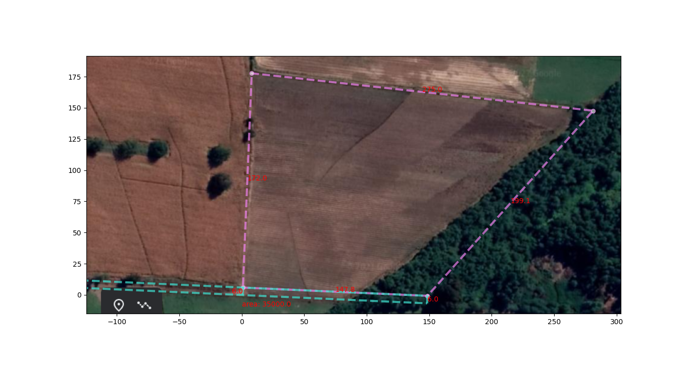

# Resumen Informe

## La contraparte afirma:

  

     - Deslinde Poniente 178m
     - Deslinde Sur 85m
     - Deslinde Norte 275m
     - Deslinde Oriente "Canal" 248m
 Se obtiene un area actual de 31.233,36 m² ~ 3,1há, faltan 0,4há según la escritura de compraventa
 
## La realidad legal:

     - Deslinde Poniente 172m (-6m incluyendo servidumbre)
     - Deslinde Sur 147.8m (65m más allá del canal)
     - Deslinde Norte 275m (sin cambios)
     - Deslinde Oriente "CORREGIDO" 199.1m  
Se obtiene un area de 35000 metros cuadrados

# Conclusión

El deslinde del terreno en entredicho no está dado por el canal al oriente, sino sobre la línea original que divide la parcela 5 y 7 (6 metros más al norte de la servidumbre que fue cedida por la parcela 7), generando un deslinde de 148 metros para albergar la superficie requerida de 3,5 hectáreas.

### Servicios topográficos de código abierto y libre

El código fuente está disponible bajo licencia [ANTI-CAPITALIST SOFTWARE LICENSE (v 1.4)](./LICENCE):  
    - [check.py](./src/check.py) provee las rutinas necesarias para cálculos de 4 puntos estáticos de latitud y longitud en un elipsoide.  
    - [InteractiveTerrainAreaCalculator.ipynb](./src/InteractiveTerrainAreaCalculator.ipynb) provee una herramienta para interactivamente cuadrar un polígono sobre una imágen de googleEarth, escalado semi-automático y cálculos en coordenadas cartesianas.  
